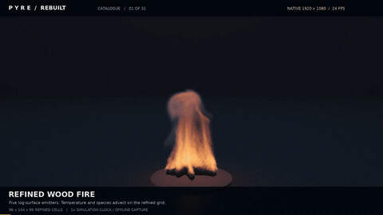
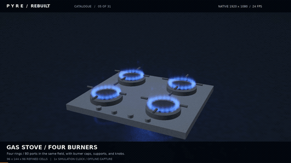
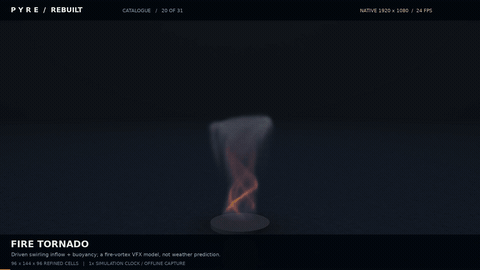
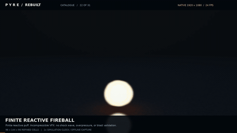

# IGNIA — reactive volumetric fire for Three.js / WebGL2

<p align="center">
  
</p>

IGNIA is a code-rendered volumetric fire and smoke simulator built around a pressure-projected velocity field, transported reactive scalars, refined subgrid chemistry fields, volumetric extinction/emission, solid boundaries, and reproducible numerical checks. The flames are simulated fields — not sprites, prerecorded flipbooks, or generated imagery.

<table>
<tr>
<td></td>
<td></td>
</tr>
<tr>
<td></td>
<td><b>31 authored presets</b><br>candles · stove burners · jets · wind · tornado · fireball · mushroom cloud · smoke · boundaries · artistic emission palettes</td>
</tr>
</table>

The README previews are **480 px wide / 10 fps full-motion GIFs encoded from the real recorded simulation clips**. The corresponding original recordings are native **1920×1080 H.264 at 24 fps**.

[Browse all 43 recorded GIFs and MP4s](docs/media/baseline/) · [scene gallery](docs/media/baseline/index.html) · [hash/decode manifest](docs/media/baseline/publication-manifest.json)

Direct 1080p examples: [wood fire](docs/media/baseline/catalogue/01_hearth.mp4) · [four-burner stove](docs/media/baseline/catalogue/05_stove4.mp4) · [fire tornado](docs/media/baseline/catalogue/20_tornado.mp4) · [finite fireball](docs/media/baseline/catalogue/22_explosion.mp4) · [mushroom-style plume](docs/media/baseline/catalogue/23_mushroom.mp4)

## Run

```bash
npm install
npm start
```

`npm install` vendors the pinned official Three.js r180 distribution into `vendor/`. The server prints and opens a loopback URL for `index.html`.

Build the self-contained studio page with:

```bash
npm run check
npm run build
```

That produces `IGNIA_Studio.html`.

## Simulation

- Pressure-projected 3D velocity / momentum field.
- Temperature, fuel, oxygen-like concentration, soot, and instantaneous reaction fields.
- Optional 2×/3× refined transported reactive fields while pressure remains on the base grid.
- Buoyancy, vorticity confinement, source geometry, directional inlet velocity, wind fields, solid masks, cooling, and soot production.
- Ray-integrated volumetric extinction and emission with cached illumination, empty-space skipping, early termination, reflections, and bloom.
- Sphere, baffle, and stove-pan solid boundaries shared by solver and renderer.
- 31 scenes spanning candles, gas burners, jets, winds, vortices, transient fireballs, mushroom-style buoyant clouds, smoke, boundaries, and optical palettes.

The combustion model is a graphics-oriented low-speed approximation with normalized VFX parameters, not experimentally calibrated chemistry or a shock solver. The mushroom-cloud preset is buoyant VFX, not nuclear-reaction physics. IGNIA does not claim proprietary EmberGen internals or established EmberGen 2.0 parity.

## Controls

Drag to orbit, scroll to dolly, Space to pause, H to hide the UI. The studio exposes source strength, fuel look, wind, vorticity, scalar refinement, exposure, collider modes, field views, presets, state export/import, still capture, flipbook export, and WebM recording.

## Verification

The recovered PYRE IV baseline from which IGNIA was renamed was exercised with a 31-scene native-1080p catalogue, high-grid checkpoint renders at 64×96×64 pressure / 128×192×128 refined fields, a 14/14 compact numerical regression suite, and the pinned Three.js r180 backend in Chromium/WebGL2.

The public media archive contains **43 original 1080p clips plus 43 GIF previews**. Its publication manifest records hashes, duration, resolution, and decode checks. README showcase paths are stable aliases to those verified media blobs, not separate generated imagery.

## License

IGNIA is GPL-2.0-only, matching this repository's existing license. Three.js remains under its upstream MIT license; see `vendor/THREE-LICENSE.txt`.
